Many micro rigs on the market (Micro Fight, D3CRM, TMR) are comprised of three primary components: The Chassis, the Harness, and the Waist Strap. This guide will show you a simple way to create a new/replacement waist strap for your micro rig that doesnt require sewing.

# Typical Waist Strap Construction

The typical waist strap is comprised of the following:
- A length of 1" Nylon Webbing (1 Yard should be fine, 17337 or 53301 should be fine. You may need more length if you have a larger body and want spare nylon bundled on the ends)
- Hardware on either end to connect to the main chassis (see next section)
- A method to retain excess webbing (see next section)

Most micro rigs use a loop of 1" nylon webbing stitched into the chassis of the rig to attach the chassis-side hardware for the waist strap to connect into. If your rig does not follow this pattern, this waist strap will not work. If there is existing hardware on the nylon loop, you may need to remove the existing hardware to attach your waist strap.

# Hardware Choices
## Chassis Attachment Hardware Choices

For the hardware used to attach the waist strap to the chassis, there are two common choices. Their traits will be provided under each:
### Split-bar Side-release buckles

This is an ITW Nexus GTSR split bar body and ladderloc latch

- Quick-Detach
- Hard to accidentally disconnect
- Holds position without needing end retention
- Longer footprint, some people find this irritating
### G-Hooks

- Quick-detach
- Easy to accidentally disconnect if the waist strap is not properly tensioned
- Holds position without needing end retention
- Metal, more resilient than polymer solutions

There are some less-common hardware choices that may work in a pinch, but lack many of the Quality Of Life features the common solutions provide.Their detriments will be provided under each:
### Split-bar Ladderlock 

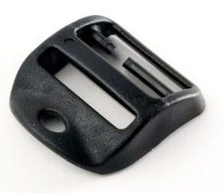

This is an ITW nexus GTLL 100 Split-Bar slider

- This requires you to adjust the waist strap size in order to put on/take off your rig, rather than setting your size once and using quick-detach
- Does not allow for quick detach
- May slip position if jostled and end retention is not present
### Split-bar Quick-Release Tubes

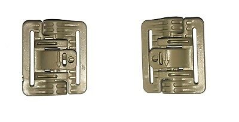

This is a set of 2m ROC buckles, they will need to be modified to become split bar.

- QR Tubes require some pushback from tension/weight lateral to the tube in order to disconnect. Waist straps do not provide enough tension to allow tubes to reliably disconnect
- Requires end retention hardware
### Split bar Looplock

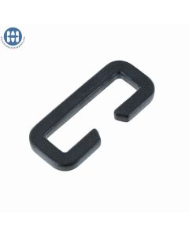

This is a generic split-bar loop.

- Very small footprint
- No quick release whatsoever
- Requires end retention hardware
- Metal and Polymer options are available

You may mix and match these types of hardware on your waist strap so you can have one on the left side, and one on the right, but generally speaking I would not suggest this.

### Aside: What Does Split-Bar Mean And Why Are We Using It?

Split bar hardware is hardware that has been modified (or designed) to have a small gap in one of the "bars" that webbing is run over to attatch the hardware to the webbing. Split-bar hardware is *necessary* for the chassis-side hardware on micro rigs, because micro rigs use stitched loops to attach hardware to the chassis. Because the loops are stitched to the chassis, you cannot just feed webbing through a typical piece of hardware. Instead, you must insert the stitched loop into the split in your bar, and force the webbing over it to attach it to the hardware. This Provides reliable, but removable hardware that can be reconfigured at will, or when the hardware breaks. Please note: Split bar hardware *is not necessary on the hardware looped onto the waist strap itself, it is only necessary on the chassis-side hardware*

## End Retention Hardware Choices

The once the waist strap's webbing is fed through your hardware of choice, you will have loose webbing flopping around on the back of your waist strap. The retention hardware will hold this back, flush with the waist strap, but still provide you with the ability to adjust the waist strap if you feel the need in the future. Excess webbing is important because you can change in size over time, and the gear you wear under your chest rig may change in the future (bulky jackets, soft armor, etc).

Your retention hardware choices are as follows, their traits are listed:
### Triglides
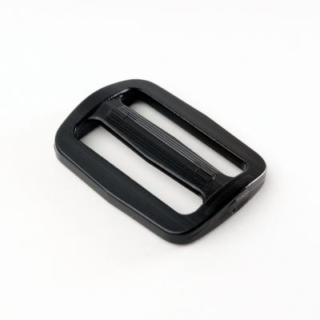

This is an ITW Nexus standard plastic triglide

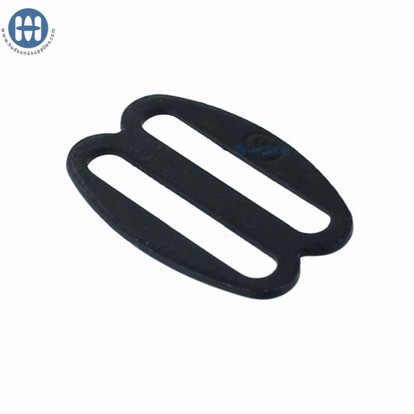

This is an ITW Nexus rounded oval slider

- Some people find these uncomfortable and describe them as "digging into" their backs
- Metal and Polymer versions are available
### Dual-Sided Hook & Loop (sold as "OneWrap" by Velcro)
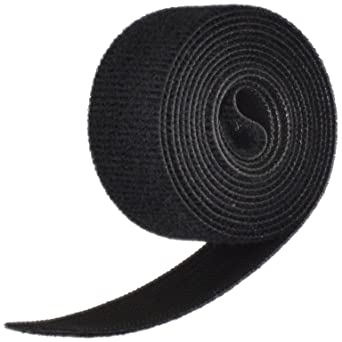

This is a roll of Velcro Brand OneWrap.

- Cannot retain meaningful loads, do not use alone with attachment hardware that requires end retention
- Allows you to bundle significant lengths of webbing in a non-intrusive way.

Please note: you may combine multple of these choices! I personally use triglides closer to my attachment hardware (for their retention strength) followed by OneWrap (to retain a significant excess length of webbing for adjustability).

# Assembly Guide

Really you can construct this based on vibes, but a little math can help you ballpark your way to the right measurements. in this guide we will be using split-bar side-release buckles, triglides, and onewrap.

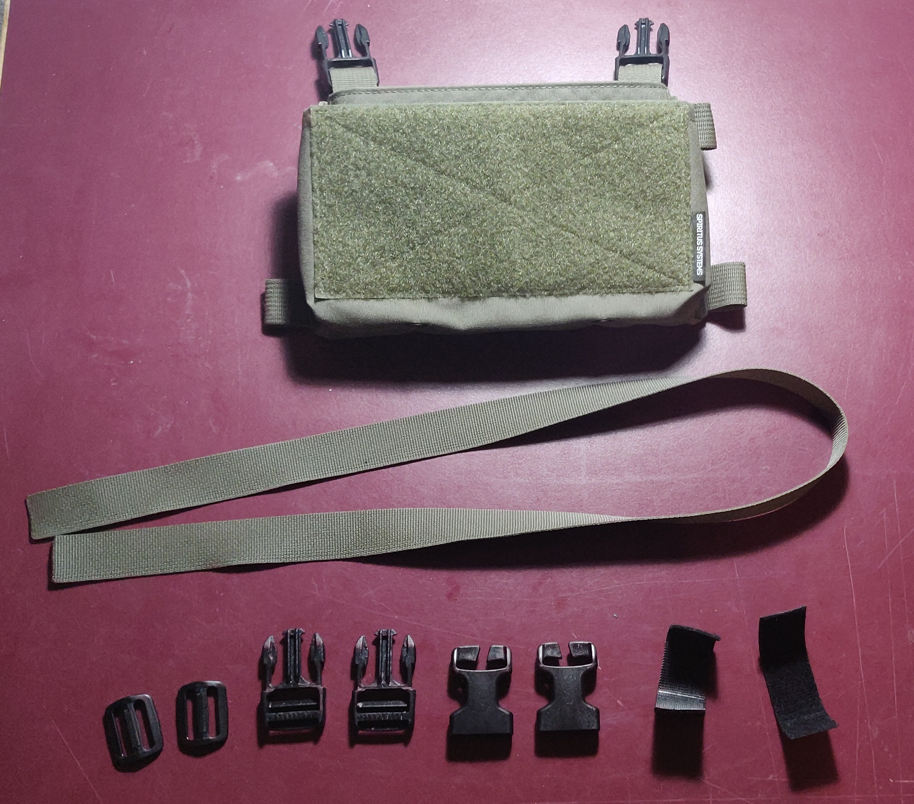

1. Attach the chassis-side attachment hardware, if any. To feed split-bar hardware onto a webbing loop, insert one edge of the webbing loop into the slot in the hardware. then, push and rotate the webbing until you can cram all of it through that slot. Once all the webbing is inside the slot, straighten it out within the slot so it lays across the bar evenly.

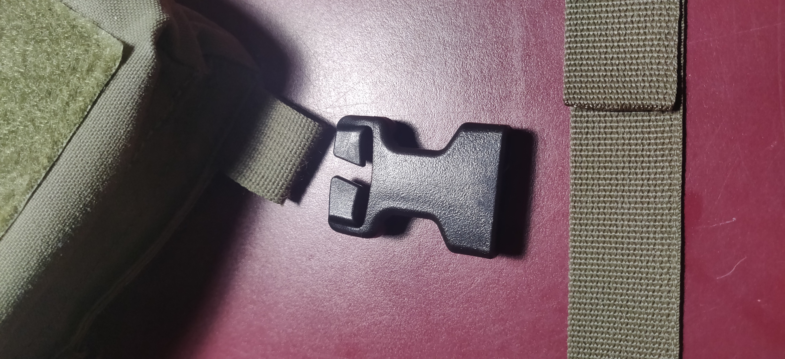
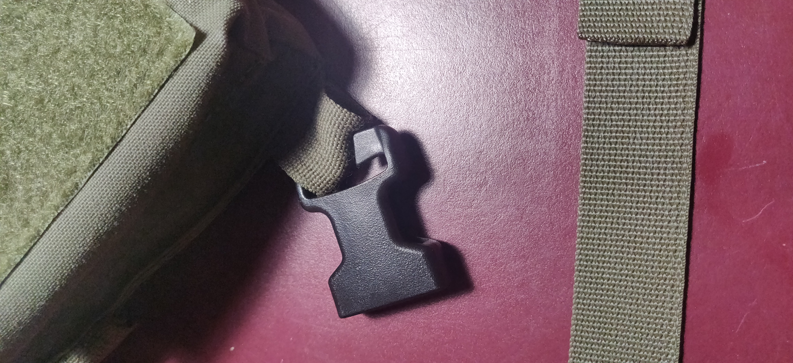

2. Measure out how much slack you want hanging off the end past your retention method. I'd recommend maybe 2-4 inches if using only triglides, 6-8 inches if using onewrap, an 8-10 inches if using both. Keep in mind I am a physically smaller person, larger folks may need more slack for future adjustability. Once you determine your amount of slack, mark the webbing with a pencil or something like that.

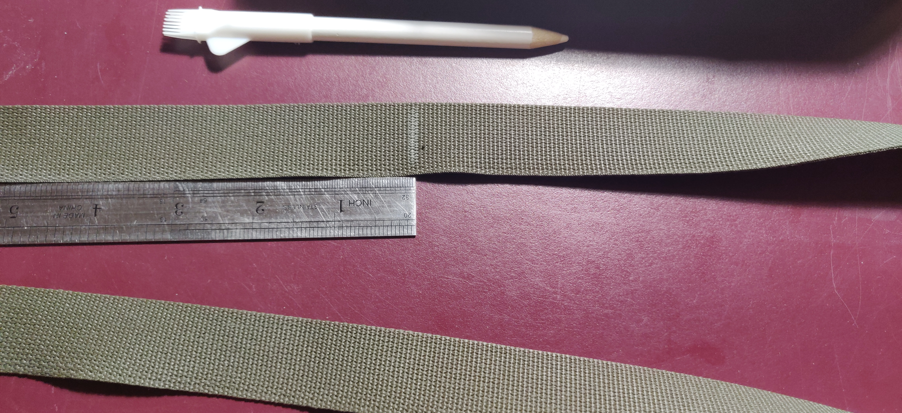

3. Feed the left attachment hardware onto your webbing and center it on top of the pencil mark you made earlier. from this point forwards, all hardware will be fed onto the webbing to the right of this hardware.

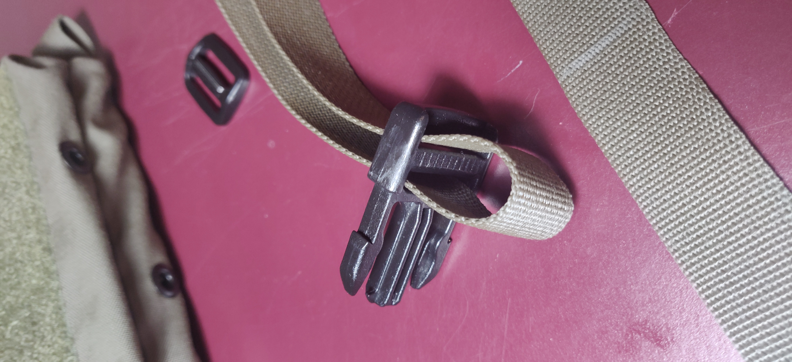

4. If using triglide retention, feed your first triglide onto the webbing. then, feed the left end of the webbing through the triglide to retain it. then, feed your second triglide onto the right side of the webbing.

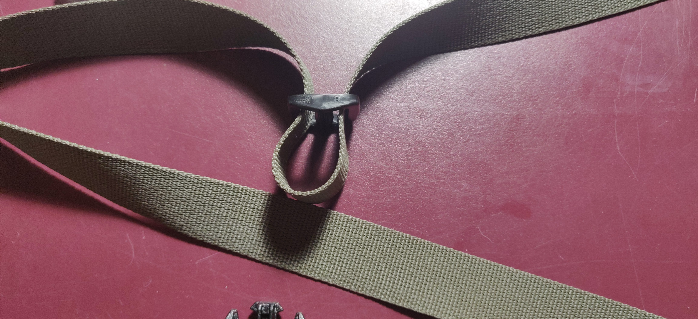

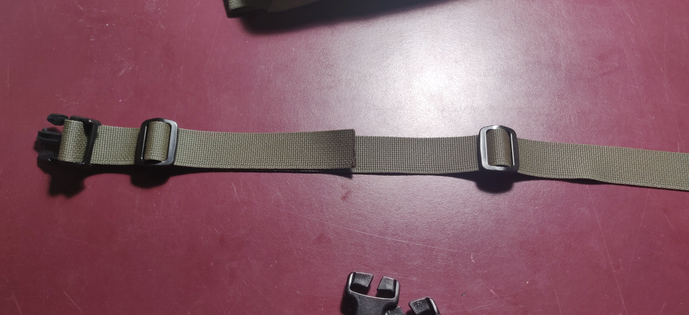

4. Feed the right attachment hardware onto the right side of your webbing, placement does not matter for now.

5. Put on your chest rig, and attach your waist strap to the chassis with the newly added hardware. Tighten the waist strap to fit, adjusting size by pulling in the slack webbing on the right side of the waist strap.

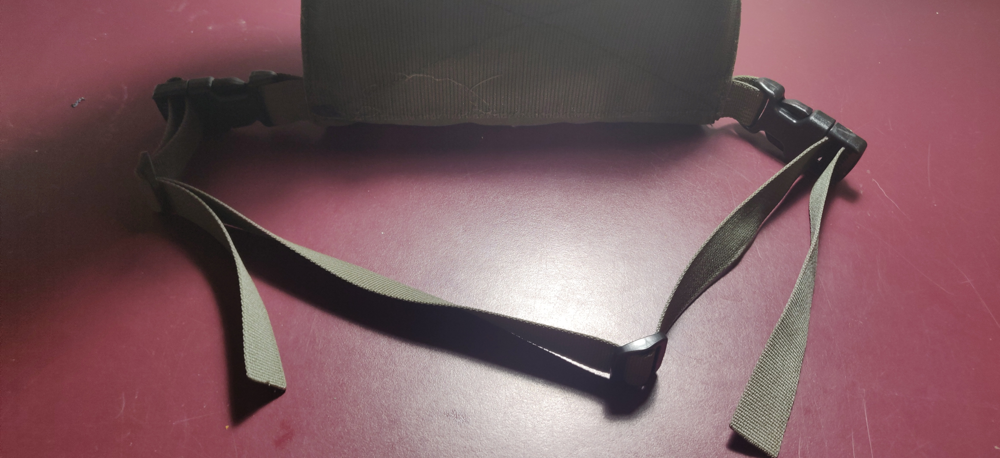

6. Detach the waist strap. Measure how much slack you determined you would use earlier, this time from the right side's hardware, and trim the webbing on the right side past the right side hardware to meet that length. 

7. If using triglides, feed the remaining excess webbing from the right back through the triglide on the right side to retain it

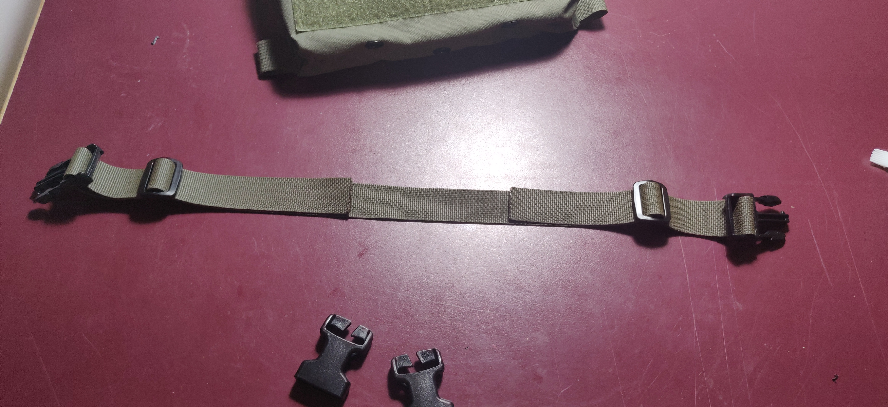
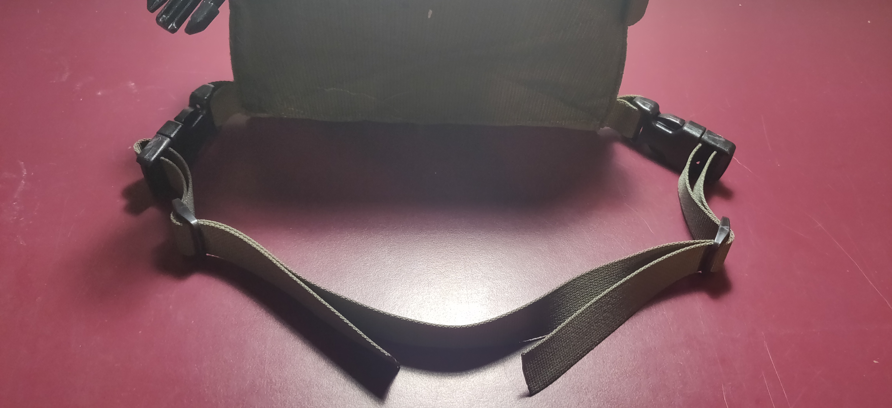

8. If using onewrap, cut a 3" length of onewrap. Place it one one of your excess lengths of webbing, forming a T shape. Now, roll the webbing up overtop of the onewrap, effectively having a roll of webbing with the length of onewrap at its core. when you have rolled up all of your excess webbing, press the webbing bundle against the main webbing of your waist strap, and fold the two loose ends of onewap over it so the onewrap attaches to itself behind the waist strap webbing, this will hold the bundle against your waist strap in case you ever need future adjustment.

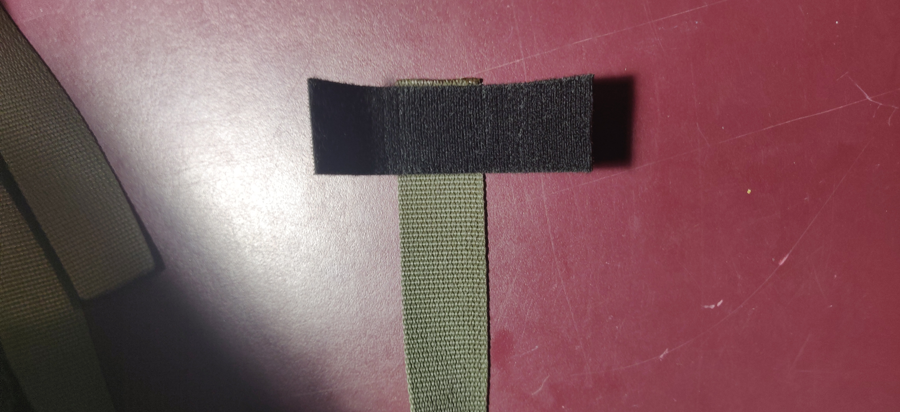

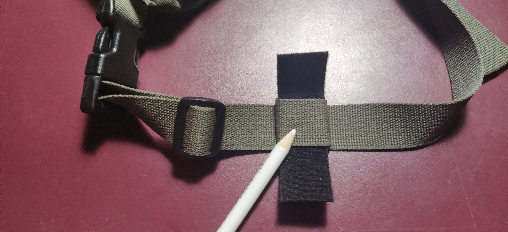

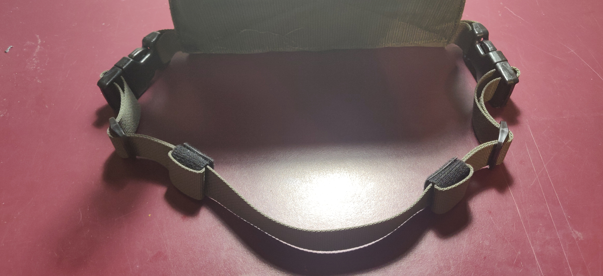
